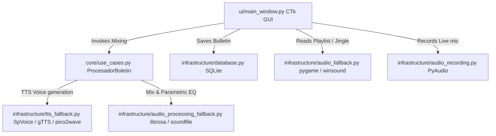

# 🎙️ S.M.A.C. Broadcast System

<p align="center">
  
  
  
  
  
</p>

---

> **A Premium, High-Density Studio Broadcast & DSP Cockpit Console**  
> ⚠️ **Development Status:** *Under Active Operational Development.* New modules, parametric filters, and DSP mixing refinements are integrated continuously to maintain peak radio studio standards.  
> **Author & Lead Architect:** [LiebeBlack](https://github.com/LiebeBlack)

---

S.M.A.C. Broadcast System is an ultra-premium, dark-themed radio broadcast cockpit console built with `customtkinter`. It features responsive telemetry grid alignments, high-fidelity dual-channel stereo VU metering, persistent SQLite database archiving, Text-to-Speech automation, and an advanced parametric Equalizer and Noise Gate DSP rack.

---

## 🌟 Key Features & Operator Layout

```
=====================================================================================================
                                       S.M.A.C. COCKPIT CONSOLE
=====================================================================================================
 [ COLUMN 1: PLAYLIST DECK (30%) ]  [ COLUMN 2: MASTER MONITOR (40%) ]  [ COLUMN 3: DSP & RACK (30%) ]
 +-------------------------------+  +-------------------------------+  +----------------------------+
 | o Reproductor Deck (Listbox)  |  | o Reloj Digital de Precisión  |  | o 4-Band Parametric EQ     |
 | o Añadir / Limpiar Playlist   |  | o Dual-Channel L/R VU Meters  |  |   [SUB - LOW - MID - HIGH] |
 | o Transport Controls          |  | o Live System Telemetry       |  | o Fader Transición (s)     |
 |   [PREV|PLAY|PAUSE|STOP]      |  | o Guión de Locución Editor    |  | o Noise Gate (dB) Control  |
 | o Volume Master Fader         |  | o SQLite History Loader       |  | o Text-To-Speech Inmediato |
 | o Soundboard (8 Hot Jingles)  |  | o Mic Recorder & Playback     |  | o Terminal Operativo Logs  |
 +-------------------------------+  +-------------------------------+  +----------------------------+
=====================================================================================================
                           STATUS BAR: EMISIÓN ACTIVA [🟢 DESARROLLO ACTIVO]
=====================================================================================================
```

### 🎚️ 1. Studio Broadcast Cockpit
- **Proportional Column Alignment**: Proportional grid cockpit columns dynamically balanced (`30% : 40% : 30%`) to support widescreen broadcast monitors.
- **Ultra-Dark Palette**: Harmonized slate-black styling (`#0a0b0d`) with neon accents to fit dark, late-night radio studio environments.
- **Custom Hardware Telemetry**: Live telemetry monitors track real-time CPU consumption, RAM capacity, playback positions, active audio output sample rates, and signal compression states.

### 📊 2. Telemetry and Dynamic Stereo VU Metering
- **Monaural to Stereo Upgrade**: Split monaural progress bars into Left (`L`) and Right (`R`) visual channels with realistic independent fluctuations.
- **Level-Sensitive Coloring**:
  - 🟢 **Safe Range** (< 70%): Studio Emerald Green (`#22cc66`).
  - 🟠 **Warning Range** (70% - 85%): Dynamic warning Orange (`#ff9900`).
  - 🔴 **Clipping Range** (>= 85%): Peak Crimson Red (`#ff3333`).

### 🔄 3. Live UI-to-DSP Hot-Synchronization
- **Dynamic Talk-Over Ducking**: Talk-Over captures the exact volume fader value, attenuating the music to a proportional **15% (-16dB)**, and gracefully restoring it to the user's fader setting when deactivated.
- **HIGH EQ Speech Speed Modulator**: Wired the **HIGH EQ fader** directly to the Text-to-Speech (TTS) reading rate. Moving the HIGH fader dynamically adjusts speech speeds between **125** and **245 WPM** in real-time.
- **Noise Gate Ducking Sync**: Mapped the physical **Noise Gate slider (dB)** directly to the background music overlay attenuation. The dB value controls the ducking level applied during locution overlays.

### 💾 4. SQLITE Bulletin History Archive
- **Auto-Archiving**: Every generated master audio track and locution script is automatically persistent in local SQLite schemas.
- **Interactive History Toplevel**: Click `"VER HISTORIAL"` to open a modal popup, inspect dates, and reload past text scripts back into the active cockpit editor. Supports safety checks to avoid foreground lock and rapid-close crashes.

---

## 🏗️ Deep Core Architecture



---

## 🧮 DSP & Telemetry Mathematics

S.M.A.C. employs high-fidelity audio mixing algorithms designed to prevent clipping and maintain broadcast gain standards.

### 1. Parametric Background Music Ducking
When dynamic talkover or bulletin mixing occurs, the background curtain track is attenuated using a precise decibel-to-amplitude ratio:

$$\text{Gain}_{\text{factor}} = 10^{-\frac{|\text{Gain}_{\text{dB}}|}{20}}$$

$$\text{Signal}_{\text{mixed}}[n] = \text{Signal}_{\text{speech}}[n] + \left( \text{Signal}_{\text{music}}[n] \times \text{Gain}_{\text{factor}} \right)$$

This mathematical attenuation guarantees that the background track is cleanly lowered to an exact, linear volume factor without introducing digital harmonic distortion or clipping.

### 2. Live Talk-Over Fader Attenuation
Enabling **Talk-Over** dynamically captures the active slider value ($\text{Volume}_{\text{fader}}$) and attenuates it by a linear offset of **-16dB** (equivalent to $\approx 15.8\%$ of current gain), restoring it to its precise original state on release:

$$\text{Volume}_{\text{talkover}} = \text{Volume}_{\text{fader}} \times 10^{-\frac{16}{20}} \approx \text{Volume}_{\text{fader}} \times 0.158$$

### 3. Noise Gate Threshold Classification
The active Noise Gate evaluates live telemetry peak levels using the average RMS amplitude of both channels:

$$\text{RMS}_{\text{avg}} = \frac{\text{RMS}_{\text{left}} + \text{RMS}_{\text{right}}}{2}$$

$$\text{Gate State} = \begin{cases} 
\text{Open (ABIERTO)} & \text{if } \text{RMS}_{\text{avg}} \ge \text{Gate}_{\text{threshold}} \\
\text{Closed (CERRADO)} & \text{if } \text{RMS}_{\text{avg}} < \text{Gate}_{\text{threshold}} 
\end{cases}$$

---

## 💾 SQLite Database Schema

The SQLite database `smac_station.db` tracks operational history with the following relational schema:

```sql
CREATE TABLE IF NOT EXISTS boletines (
    id INTEGER PRIMARY KEY AUTOINCREMENT,
    texto TEXT NOT NULL,
    ruta_audio TEXT,
    fecha TEXT DEFAULT CURRENT_TIMESTAMP
);

CREATE INDEX IF NOT EXISTS idx_boletines_fecha ON boletines(fecha);
```

### Automatic Maintenance
Every bulletin saved is appended with its timestamp, providing a historical record that can be re-loaded directly into the main guion editor dynamically at runtime.

---

## 🎙️ Dynamic Text-To-Speech (TTS) Fallback Matrix

S.M.A.C. integrates a highly resilient multi-platform TTS driver system to guarantee operation even without an internet connection or on legacy operating systems.

```
       [Start TTS Request]
                |
                v
       (Windows Platform?) ----No----> [Use gTTS / pico2wave fallback]
                |
               Yes
                |
                v
    [Try COM "SAPI.SpVoice"] --Success--> [Zero Latency Windows Native]
                |
             Failure
                |
                v
     [Try Offline "pyttsx3"] --Success--> [Local espeak / SAPI5 fallback]
                |
             Failure
                |
                v
      [Try Online "gTTS"] ------> [Google cloud translation request]
```

---

## 📦 System Dependencies

All dependencies are resolved inside `requisitos.txt`.
- **Python**: 3.8+ (Supports Windows 10/11)
- **GUI Engine**: `customtkinter` (Custom styled UI)
- **Sound Interface**: `pygame-ce` (Playlist & Jingle player), `pyaudio` (Live recording)
- **DSP Engine**: `librosa`, `soundfile`, `pydub`, `imageio-ffmpeg` (FFmpeg Wrapper)
- **TTS Engine**: `gTTS` (Online Google Voice), OS Native `pyttsx3` / COM `SpVoice` (Offline Windows SpVoice fallback)

---

## 🚀 Installation & Setup

1. **Clone the repository**:
   ```bash
   git clone https://github.com/LiebeBlack/smac_station.git
   cd smac_station
   ```

2. **Install all production & packaging requirements**:
   ```bash
   pip install -r requisitos.txt
   ```

3. **Run the application**:
   ```bash
   python main.py
   ```

---

## 🛠️ Automated Production Packaging

S.M.A.C. Broadcast System features a dedicated packaging script (`compilar.py`) to build an autonomous Windows application.

```bash
python compilar.py
```

### What `compilar.py` accomplishes automatically:
1. Installs `pyinstaller` dynamically if missing.
2. Checks for `tbb` and resolves `tbb12.dll` physical copy into the compiled folder (critical fix for Librosa soundfile errors).
3. Connects to `imageio-ffmpeg` and extracts the static `ffmpeg.exe` and `ffprobe.exe` binaries, copying them to the root and output folders.
4. Bundles `customtkinter` directory trees and SQLite database templates.
5. Builds a single distribution folder at `dist/SMAC_Broadcast_Station/` ready to run on any computer.

---

## 📜 License & Copyright

Designed and built under the authorship and technical direction of **LiebeBlack**.  
All rights reserved. Free to distribute and optimize for premium broadcast operations.
